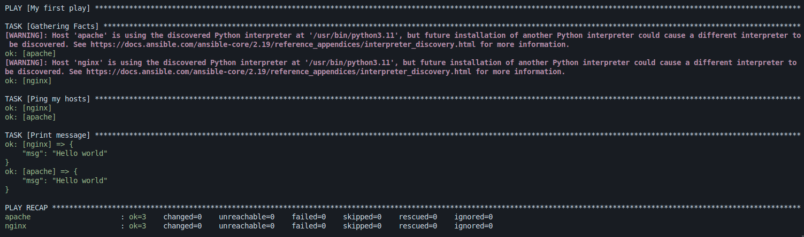

วิธีให้ Ansible เชื่อมต่อกับ VM ที่สร้างโดย Vagrant

Vagrant มีคำสั่งที่สร้าง ssh config

```sh
vagrant ssh-config
```

เราสามารถ pipe เพื่อ create file ได้ด้วย

```sh
vagrant ssh-config > ./ssh_config
```

แล้วเราสามารถสร้าง `inventory.ini` ได้แบบนี้

```ini
[vagrant]
nginx
apache

```

โดยไม่ต้องมี `ansible_host=127.0.0.1` `ansible_port=2222` `ansible_user=vagrant` `ansible_ssh_private_key_file=path/to/private_key`

เพราะถ้ามี variable เหล่านี้ Ansible จะ Ignore Host ใน ssh config แล้วใช้ใน inventory.ini แทน (⚠️ ระวังตรงนี้ )

ลองสร้าง `playbook.yaml` แบบ simple เพื่อ Test

```yaml
- name: My first play
  hosts: all
  tasks:
    - name: Ping my hosts
      ansible.builtin.ping:

    - name: Print message
      ansible.builtin.debug:
        msg: Hello world
```

แล้วรันด้วย

```sh
#!/bin/sh

export ANSIBLE_HOST_KEY_CHECKING=False
export ANSIBLE_SSH_COMMON_ARGS="-F ssh_config"

ansible-playbook -i ansible/inventory.ini ansible/playbook.yaml
```

<br>

### Explain

`ANSIBLE_HOST_KEY_CHECKING` ปิด prompt แบบข้างล่างนี้ตอน ssh ต่อ host ที่ไม่รู้จัก

```
# This key is not known by any other names.
# Are you sure you want to continue connecting (yes/no/[fingerprint])?
```

<br>

`ANSIBLE_SSH_COMMON_ARGS` specify path ไปที่ ssh config จาก `vagrant ssh-config`

ด้วย value `"-F ssh_config"` แล้วให้ ansible เรียกใช้ file นี้แทน

<br>
Command:

```sh
ansible-playbook -i ansible/inventory.ini ansible/playbook.yaml
```

WHERE

`-i ansible/inventory.ini` คือ path ของ inventory

`ansible/playbook.yaml` แล้วตามด้วย path ของ playbook

Output



<br>

เท่านี้เราก็สามารถใช้ Ansible จัดการกับ Vagrant ได้แล้ว 😄

<br>

### Source code

[https://github.com/wuttinanhi/hello-vagrant/tree/vagrant-ansible](https://github.com/wuttinanhi/hello-vagrant/tree/vagrant-ansible)
