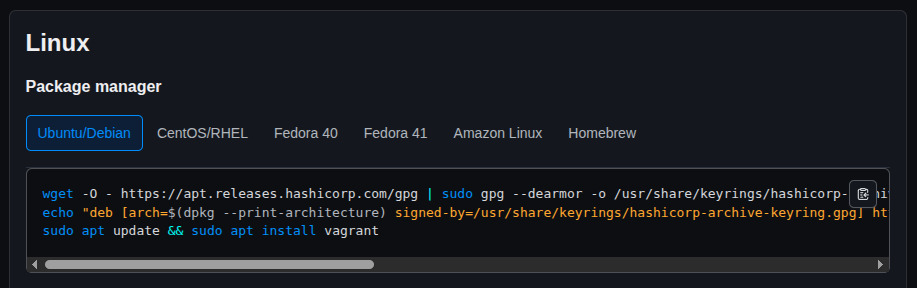

วันนี้ได้ลองใช้ Vagrant + Virtual Box อีกรอบ ปัดฝุ่นความรู้เพื่อที่จะเอาไปสร้าง Server Linux บนเครื่องตัวเองไว้ทดสอบ Docker Container กับ Ansible ก่อน Deploy งานตัวเองขึ้น Server จริง

<br/>

## Setup Lab

ลง Vagrant ตาม Instruction ของ Official Website

[https://developer.hashicorp.com/vagrant/downloads#linux](https://developer.hashicorp.com/vagrant/downloads#linux)



<br/>

### The Code

Vagrantfile

```rb
Vagrant.configure("2") do |config|
    config.vm.box = "hashicorp-education/ubuntu-24-04"
    config.vm.box_version = "0.1.0"

    # Install Docker and dependencies
    # install-dependencies.sh from https://developer.hashicorp.com/vagrant/tutorials/get-started/provision#update-your-vagrantfile
    config.vm.provision "shell", name: "install-dependencies", path: "./install-dependencies.sh"

    # Define Nginx VM
    config.vm.define "nginx" do |nginx|
        nginx.vm.hostname = "nginx"
        nginx.vm.network "private_network", ip: '192.168.56.11'
        nginx.vm.network "forwarded_port", guest: 80, host: 8082

        nginx.vm.provision "shell", name: "start-nginx", inline: <<-SHELL
            docker run -d -p 80:80 --restart always --name "nginx" nginx
        SHELL
    end
end
```

จากนั้นลอง

```sh
vagrant up
```

เพื่อสร้าง VM ขึ้นมา

### Explain

เลือก Box ที่จะใช้สร้าง VM (คล้ายๆ Docker Image)

```rb
config.vm.box = "hashicorp-education/ubuntu-24-04"
```

Provision เป็น เหมือน setup หลังสร้าง VM

```rb
config.vm.provision "shell", name: "install-dependencies", path: "./install-dependencies.sh"
```

สร้าง VM ด้วย block

```rb
    # Define Nginx VM
    config.vm.define "nginx" do |nginx|
        nginx.vm.hostname = "nginx"
        nginx.vm.network "private_network", ip: '192.168.56.11'
        nginx.vm.network "forwarded_port", guest: 80, host: 8082

        nginx.vm.provision "shell", name: "start-nginx", inline: <<-SHELL
            docker run -d -p 80:80 --restart always --name "nginx" nginx
        SHELL
    end
```

เราสามารถ set IP ของ VM และสามารถ access ผ่านเหมือนมี server อยู่ในวง LAN เราได้เลย

```rb
nginx.vm.network "private_network", ip: '192.168.56.11'
```

ส่วน Forward Port ตรงนี้จะ Tricky หน่อย

```rb
nginx.vm.network "forwarded_port", guest: 80, host: 8082
```

`guest: 80` คือพอร์ตใน VM

`host: 8082` คือพอร์ตบนเครื่อง host ที่ forward ไปยัง VM:80  

เข้าได้ผ่าน `http://localhost:8082` (หรือ IP ของเครื่อง host)

ถ้าจะเข้าโดยใช้ IP ของ VM `192.168.56.11` ให้ใช้ `http://192.168.56.11:80` (ไม่ใช่ `:8082`)

<br>

### ⚠️ ถ้ามี `config.vm.define` หลาย block <br> `host` port สามารถชนกันได้ ต้องระวังตรงนี้

<br>

### Other Commands

<br>

#### Stop VM

```sh
vagrant halt
```

#### Pause/Resume VM

```sh
vagrant suspend/resume
```

#### Delete VM

```sh
vagrant destroy
```

ใส่ `-f` เพื่อไม่ให้ถามก่อนลบ

<br>

#### Delete Box

```sh
vagrant box remove hashicorp-education/ubuntu-24-04
```

#### Up only service

```sh
vagrant up nginx
```

#### Run only single provision

```sh
vagrant up --provision-with start-nginx
```

<br><br>

### Source Code

[https://github.com/wuttinanhi/hello-vagrant](https://github.com/wuttinanhi/hello-vagrant)
