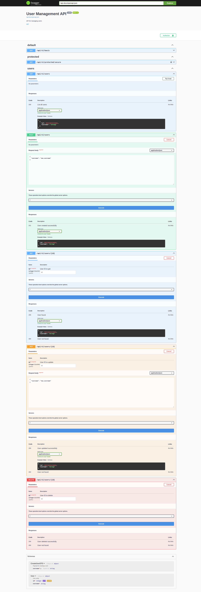

# ต่อจาก EP1

Episode นี้เราจะมาสร้าง OpenAPI routes แบบ Advanced กัน

## Let's Advance!

เราลองมาสร้าง Entity & DTO สำหรับ hold data ของเรา

```rust title="src/entity/mod.rs"
use serde::{Deserialize, Serialize};

use serde::{Deserialize, Serialize};

/// User entity
#[derive(Serialize, Deserialize, utoipa::ToSchema)]
pub struct User {
    pub id: u64,
    pub username: String,
}

/// Payload for creating a user
#[derive(Serialize, Deserialize, utoipa::ToSchema)]
pub struct CreateUserDTO {
    #[schema(example = "new.username")]
    pub username: String,
}

/// Payload for updating an existing user
#[derive(Serialize, Deserialize, utoipa::ToSchema)]
pub struct UpdateUserDTO {
    #[schema(example = "update.username")]
    pub username: String,
}

```

สังเกตุว่าเราต้อง derive `utoipa::ToSchema`

และเราสามารถ set example value บน struct field ด้วย `#[schema(example = "YOUR_EXAMPLE_HERE")]`

### สร้าง mock repository สำหรับ CRUD User

เขียน user repository แบบง่ายๆ

โดยใช้ RwLock กับ AtomicU64 เพื่อให้ thread safe

```rust title="src/repository/user_db_mock.rs"
use crate::entity::User;
use std::collections::HashMap;
use std::sync::RwLock;
use std::sync::atomic::{AtomicU64, Ordering};

pub struct UserDbMock {
    users: RwLock<HashMap<u64, String>>,
    next_id: AtomicU64,
}

impl UserDbMock {
    pub fn new() -> Self {
        Self {
            users: RwLock::new(HashMap::new()),
            next_id: AtomicU64::new(1),
        }
    }

    pub fn create_user(&self, username: String) -> User {
        let id = self.next_id.fetch_add(1, Ordering::SeqCst);

        let user = User {
            id,
            username: username.clone(),
        };

        let mut users_guard = self.users.write().unwrap();

        users_guard.insert(id, username);

        user
    }

    pub fn get_user(&self, user_id: u64) -> Option<User> {
        let users_guard = self.users.read().unwrap();

        users_guard.get(&user_id).map(|username| User {
            id: user_id,
            username: username.clone(),
        })
    }

    pub fn update_user(&self, user_id: u64, new_username: String) -> Option<User> {
        let mut users_guard = self.users.write().unwrap();

        if let Some(username) = users_guard.get_mut(&user_id) {
            *username = new_username.clone();
            Some(User {
                id: user_id,
                username: new_username,
            })
        } else {
            None
        }
    }

    pub fn delete_user(&self, user_id: u64) -> bool {
        let mut users_guard = self.users.write().unwrap();

        users_guard.remove(&user_id).is_some()
    }

    pub fn list_users(&self) -> Vec<User> {
        let users_guard = self.users.read().unwrap();

        users_guard
            .iter()
            .map(|(&id, username)| User {
                id,
                username: username.clone(),
            })
            .collect()
    }
}
```

สร้าง tag สำหรับ routes ของเรา

```rust
pub const USERS_TAG: &str = "users";
```

สร้าง API routes สำหรับ create user

```diff lang=rust title="src/routes/users.rs"
#[utoipa::path(
    method(post),
    path = "",
+    tag = USERS_TAG,
+    request_body = CreateUserDTO,
+    responses(
+        (status = CREATED, description = "User created successfully", body = User)
+    )
)]
async fn create_user(
    State(app_state): State<AppState>,
    Json(payload): Json<CreateUserDTO>,
) -> (StatusCode, Json<User>) {
    let user = User {
        id: 0,
        username: payload.username,
    };

    let created_user = app_state.user_db.create_user(user.username.clone());

    (StatusCode::CREATED, Json(created_user))
}
```

### สังเกตุ

เราเพิ่ม `tag` เพื่อจัดกลุ่ม API routes

`request_body = CreateUserDTO` เพื่อบอกว่า struct DTO ไหนสำหรับ request

และเพิ่ม responses พร้อม `status` `description` และ set response body ด้วย `body = User`

### Get by ID route

```diff lang="rust" title="src/routes/users.rs"
#[utoipa::path(
    get,
    path = "/{id}",
+    tag = USERS_TAG,
+    params(
+        ("id" = i32, Path, description = "User ID to get")
+    ),
+    responses(
+        (status = OK, description = "User found", body = User),
+        (status = NOT_FOUND, description = "User not found")
    )
)]
async fn get_user(State(app_state): State<AppState>, Path(id): Path<u64>) -> Response {
    match app_state.user_db.get_user(id) {
        Some(user) => (StatusCode::OK, Json(user)).into_response(),
        None => StatusCode::NOT_FOUND.into_response(),
    }
}
```

route นี้เราจะเพิ่ม `params` ขึ้นมา

`"id" = i32` ต้องเป็น double quote ไม่งั้นจะ Error

`Path` specify เพื่อบอกว่าใช้ Extractor อะไร

และเราสามารถเพิ่ม responses ในหลาย result ได้ ในกรณีนี้คือ User not found

### Update User route

```diff lang="rust" title="src/routes/users.rs"
#[utoipa::path(
    put,
    path = "/{id}",
    tag = USERS_TAG,
    params(
        ("id" = u64, Path, description = "User ID to update")
    ),
    request_body = CreateUserDTO,
    responses(
        (status = OK, description = "User updated successfully", body = User),
        (status = NOT_FOUND, description = "User not found")
    )
)]
async fn update_user(
    State(app_state): State<AppState>,
    Path(id): Path<u64>,
    Json(payload): Json<UpdateUserDTO>,
) -> Response {
    match app_state.user_db.update_user(id, payload.username) {
        Some(user) => (StatusCode::OK, Json(user)).into_response(),
        None => StatusCode::NOT_FOUND.into_response(),
    }
}
```

route นี้จะเหมือนกับข้างบนเลย เปลี่ยนแค่ HTTP method ใน `#[utoipa::path]` และ logic code block

### Delete User route

```diff lang="rust" title="src/routes/users.rs"
#[utoipa::path(
    delete,
    path = "/{id}",
    tag = USERS_TAG,
    params(
        ("id" = u64, Path, description = "User ID to delete")
    ),
    responses(
        (status = NO_CONTENT, description = "User deleted successfully"),
        (status = NOT_FOUND, description = "User not found")
    )
)]
async fn delete_user(State(app_state): State<AppState>, Path(id): Path<u64>) -> StatusCode {
    if app_state.user_db.delete_user(id) {
        // 204 NO_CONTENT is standard for a successful DELETE
        StatusCode::NO_CONTENT
    } else {
        StatusCode::NOT_FOUND
    }
}

```

### Combine routes into single OpenApiRouter

```diff lang="rust" title="src/routes/users.rs"
pub fn users_openapi_router(app_state: AppState) -> utoipa_axum::router::OpenApiRouter {
    utoipa_axum::router::OpenApiRouter::new()
        .routes(utoipa_axum::routes!(create_user))
        .routes(utoipa_axum::routes!(get_user))
        .routes(utoipa_axum::routes!(list_users))
        .routes(utoipa_axum::routes!(update_user))
        .routes(utoipa_axum::routes!(delete_user))
        .with_state(app_state)
}
```

เราต้องเพิ่ม `.with_state(app_state)` ใน code ช่วงนี้ และไม่สามารถเพิ่ม router ใน `src/main.rs` ได้

🤔 ทำไมไม่รวม routes ในวงเล็บเดียวกันหล่ะ?

https://stackoverflow.com/questions/79257508/overlapping-method-route-rust-axum-utoipa

### Add User OpenApiRouter into Main Router

```diff lang="rust" title="src/main.rs"
    let (router, api) = utoipa_axum::router::OpenApiRouter::with_openapi(ApiDoc::openapi())
        .nest(
            "/api/v1/basic",
            rust_axum_swagger_example::routes::basic::basic_openapi_router(),
        )
+        .nest(
+            "/api/v1/users",
+            rust_axum_swagger_example::routes::users::users_openapi_router(app_state.clone()),
        )
        .split_for_parts();
```

## Cargo Run it Again!

เราจะเห็นว่าเราจะมี input field สำหรับ request body

และ input field สำหรับ params id

<br/>



<br>

# Conclusion

เราใช้ Axum + Utoipa เพื่อสร้าง Axum API Server พร้อมกับ OpenAPI แบบ Code-First approach

ทำให้เราไม่ต้องไปเขียน API definition เอง

เราอาจจะเขียนโค๊ด Rust เยอะหน่อยแต่ว่า worth trying นะ

<br>

<p align="center">
  
</p>

<br>

## Source Code

[https://github.com/wuttinanhi/rust-axum-swagger-example](https://github.com/wuttinanhi/rust-axum-swagger-example)
