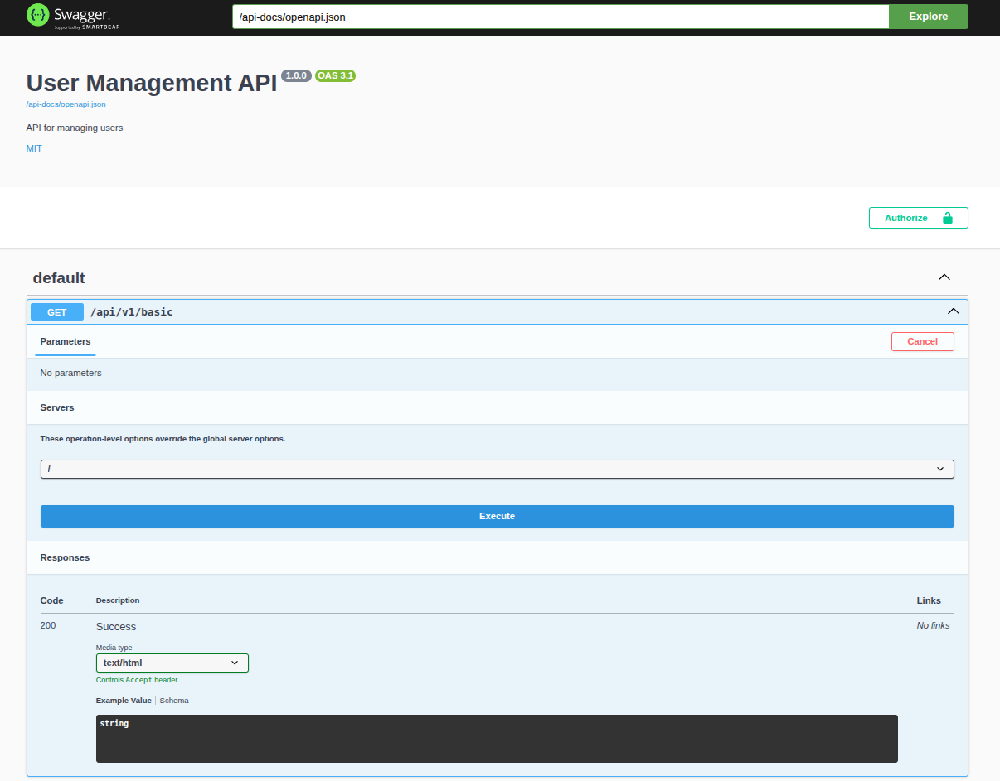
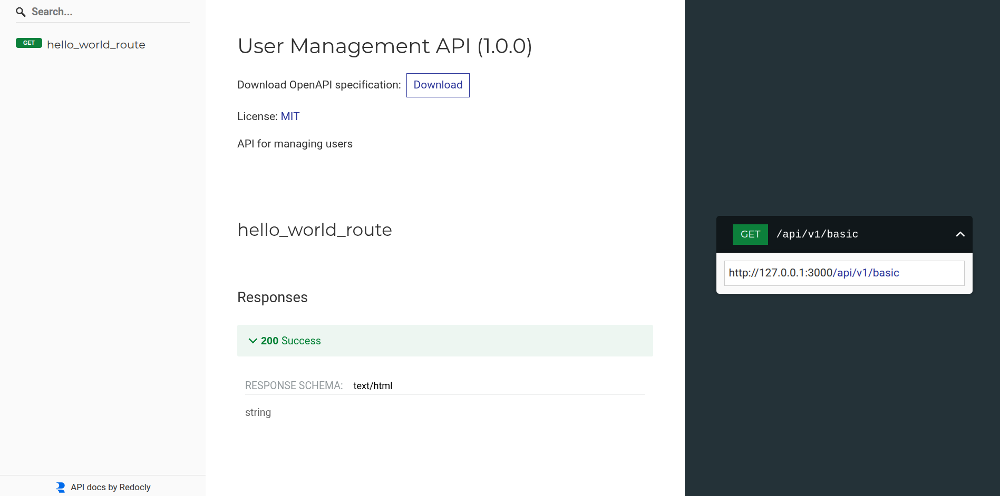
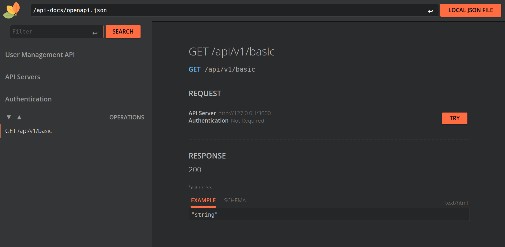
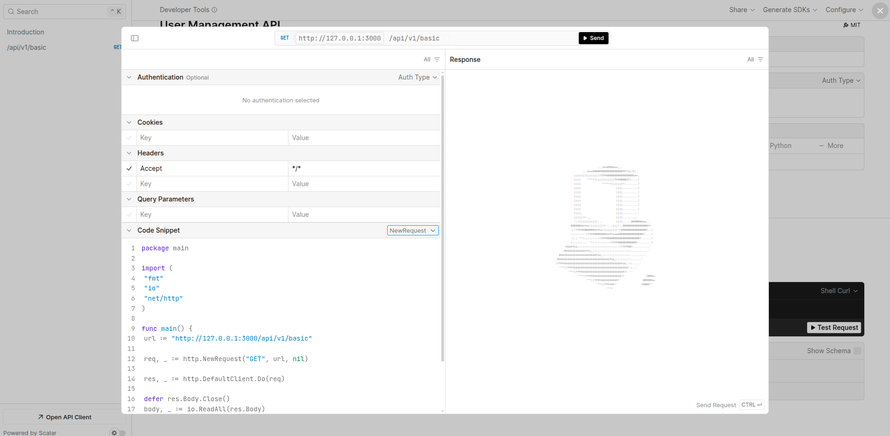

พอดีเห็นโพสต์ผ่าน timeline ในกลุ่ม rust เกี่ยวกับ rust + openapi เลยอยากลองทำดูบ้าง

## Coding Time!

ใน `Cargo.toml` ต้องมี crate axum utoipa และอื่นๆตามนี้

```toml title="Cargo.toml"
[package]
name = "rust-axum-swagger-example"
version = "0.1.0"
edition = "2024"

[dependencies]
axum = { version = "0.8.6" }
axum-extra = { version = "0.12.1", features = ["typed-header"] }
utoipa = { version = "5.4.0", features = ["axum_extras"] }
utoipa-axum = { version = "0.2.0" }
serde = { version = "1.0.228", features = ["derive"] }
tokio = { version = "1.48.0", features = ["full"] }
utoipa-swagger-ui = { version = "9.0.2", features = ["axum", "reqwest", "url"] }
utoipa-redoc = { version = "6.0.0", features = ["axum"] }
utoipa-rapidoc = { version = "6.0.0", features = ["axum"] }
utoipa-scalar = { version = "0.3.0", features = ["axum"] }
tower-http = { version = "0.6.6", features = ["cors"] }
```

### สร้าง API basic route

เราลองมาสร้าง api route แบบง่ายๆกัน

```rust title="src/routes/basic.rs"
use axum::response::Html;

// basic handler that responds with a static string
#[utoipa::path(
    method(get),
    path = "/",
    responses(
        (status = OK, description = "Success", body = str, content_type = "text/html")
    )
)]
pub async fn hello_world_route() -> Html<String> {
    Html(r#"Hello, World!"#.to_string()
    )
}
```

เราสามารถกำหนด `method` `path` `response` ด้วย macro attribute `#[utoipa::path()]` แบบตัวอย่างได้เลย

หาก return response body เป็น JSON เราสามารถกำหนดได้ด้วย struct เช่น `body = User`

### สร้าง OpenAPI router

สร้าง OpenAPI router และใส่ fn route ที่สร้างในวงเล็บ `utoipa_axum::routes!()`

```rust
pub fn basic_openapi_router() -> utoipa_axum::router::OpenApiRouter {
    utoipa_axum::router::OpenApiRouter::new().routes(utoipa_axum::routes!(hello_world_route))
}
```

### นำ OpenAPI router มาใช้ใน Axum

สร้าง struct `ApiDoc` เพื่อนำไปใช้ใน code สร้าง Utoipa OpenApiRouter ต่อข้างล่าง

```rust title="src/main.rs"
use utoipa::{OpenApi};

#[derive(OpenApi)]
#[openapi(
    info(
        title = "Basic API",
        version = "1.0.0",
        description = "Basic API created with Axum + Utoipa!",
        license(
            name = "MIT",
            url = "https://opensource.org/license/mit/"
        )
    )
)]
pub struct ApiDoc;
```

สร้าง router และ run app

```rust title="src/main.rs"
use axum::http::header;
use rust_axum_swagger_example::repository::UserDbMock;
use rust_axum_swagger_example::routes::basic;
use rust_axum_swagger_example::{ApiDoc, AppState};
use std::sync::Arc;
use utoipa::OpenApi;
use utoipa_redoc::Servable as RedocServable;
use utoipa_scalar::{Scalar, Servable as ScalarServable};

#[tokio::main]
async fn main() {
    let (router, api) = utoipa_axum::router::OpenApiRouter::with_openapi(ApiDoc::openapi())
        .nest("/api/v1/basic", basic_openapi_router())
        .split_for_parts();

    // build our application with a route
    let app = router
        // Swagger UI route
        .merge(
            utoipa_swagger_ui::SwaggerUi::new("/docs").url("/api-docs/openapi.json", api.clone()),
        );

    println!("Serving on http://127.0.0.1:3000");
    let listener = tokio::net::TcpListener::bind("0.0.0.0:3000").await.unwrap();
    axum::serve(listener, app).await.unwrap();
}
```

โค๊ดนี้จะดูแปลกๆหน่อยเราจะสร้าง Router หลักของเราจาก

```rust
utoipa_axum::router::OpenApiRouter::with_openapi(ApiDoc::openapi())
```

และ define parent api route `/api/v1/basic` แล้วใส่ basic_openapi_router()

```rust
.nest("/api/v1/basic", basic_openapi_router())
```

แล้วใช้

```rust
.split_for_parts();
```

เพื่อที่จะได้ `router` กับ `api` มาใช้ต่อไป

#### จากนั้น

```rust
    // build our application with a route
    let app = router
        // Swagger UI route
        .merge(
            utoipa_swagger_ui::SwaggerUi::new("/docs").url("/api-docs/openapi.json", api.clone()),
        );
```

เราจะเพิ่ม swagger UI เพื่อให้สามารถเรียกดูได้ผ่าน `/docs`

- `/api-docs/openapi.json` คือที่อยู่ของ OpenAPI difinition ของ API เรา

- เราต้องใส่ `api.clone()` จากข้างบนเพื่อบอกว่า API ของเราคืออันไหน

#### ลองรันดูแล้วเข้าไปที่ http /docs เพื่อดู swagger UI



<br/>

### ลองใช้ OpenAPI UI แบบอื่นดูบ้าง

#### Redoc

```diff lang="rust"
  let app = router
        // Swagger UI route
        .merge(
            utoipa_swagger_ui::SwaggerUi::new("/docs").url("/api-docs/openapi.json", api.clone()),
        )
+        // Redoc route
+        .merge(utoipa_redoc::Redoc::with_url("/redoc", api.clone()));
        // the rest of the code....
```



<br/>

#### Rapidoc

```diff lang="rust"
  let app = router
        // Swagger UI route
        .merge(
            utoipa_swagger_ui::SwaggerUi::new("/docs").url("/api-docs/openapi.json", api.clone()),
        )
+        // Rapidoc route
+       .merge(utoipa_rapidoc::RapiDoc::new("/api-docs/openapi.json").path("/rapidoc"))
        // the rest of the code....
```



<br/>

#### Scalar

```diff lang="rust"
  let app = router
        // Swagger UI route
        .merge(
            utoipa_swagger_ui::SwaggerUi::new("/docs").url("/api-docs/openapi.json", api.clone()),
        )
+        // Scalar UI route
+        .merge(Scalar::with_url("/scalar", api))
        // the rest of the code....
```



<br/>

ส่วนตัวชอบ Scalar เพราะมี UI modern กว่าแล้ว generate code ได้

<br/>

# Next Chapter

เราจะสร้าง OpenAPI routes สำหรับรับข้อมูล / ใช้ http method อื่นๆ / ใช้ `/{param}` / etc

[/blog/rust-axum-openapi-ep2](/blog/rust-axum-openapi-ep2)
